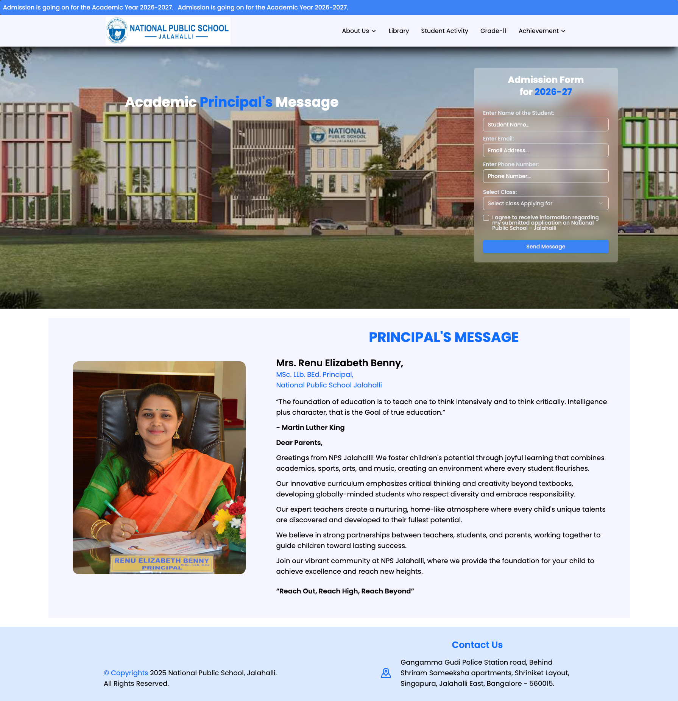

# NPS Jalahalli – Promotional Website for Google Ads Campaign

> Disclaimer: This is a promotional landing website built for NPS Jalahalli’s Google Ads campaign and is separate from the school’s primary official website.

A modern, responsive school website built for **NPS Jalahalli** using **React (Vite)** and **Tailwind CSS**.  
The site focuses on performance, clean UI, and a clear content structure for parents, students, and staff.


## ✨ Features

- ⚡ **Fast & modern stack** – React with Vite for a snappy SPA experience and smooth navigation.
- 🎨 **Responsive UI with Tailwind CSS** – Fully mobile-friendly layout optimized for phones, tablets, and desktops.
- 🧭 **Client-side routing** – Navigation powered by `react-router-dom` for an app-like experience.
- 📩 **Contact & enquiry forms** – Integrated with **Web3Forms** to send submissions directly to email (no custom backend required).
- 🧩 **Reusable components** – Section-based components for hero, academics, facilities, gallery, contact, and more.
- 🎬 **Scroll animations** – Subtle entry animations using `aos` to make the experience more engaging without being distracting.
- 📰 **Announcement marquee** – Built with `react-fast-marquee` to highlight important notices and updates.
- ✅ **Form validation & UX** – `react-hook-form` for validation and `react-toastify` for instant feedback (success/error toasts).
- 🖼️ **Iconography** – Clean icon set using `lucide-react` and `react-icons` for consistent visual language.


## 💡 Project Highlights


- **Real-world client build** – Designed and developed specifically for NPS Jalahalli, reflecting real content and requirements.
- **Performance-conscious** – Built with Vite, optimized components, and Tailwind utility classes to keep pages lightweight.
- **Maintainable architecture** – Component-driven structure so new sections or pages can be added with minimal refactoring.
- **Backend-free form handling** – Web3Forms handles all form submissions via email, simplifying deployment and hosting.
- **Production-focused decisions** – Libraries chosen with long-term maintainability and readability in mind (routing, forms, animations, notifications)
## 🛠 Tech Stack

**Core:**
- [React](https://react.dev/)
- [Vite](https://vitejs.dev/)
- [Tailwind CSS](https://tailwindcss.com/)
- [React Router DOM](https://reactrouter.com/)

**Forms & UX:**
- [Web3Forms](https://web3forms.com/) – serverless form handling via email  
- [react-hook-form](https://react-hook-form.com/) – form state & validation  
- [react-toastify](https://fkhadra.github.io/react-toastify/) – toast notifications  

**UI Enhancements:**
- [AOS](https://michalsnik.github.io/aos/) – animate on scroll  
- [react-fast-marquee](https://www.npmjs.com/package/react-fast-marquee) – announcement marquee  
- [lucide-react](https://lucide.dev/) & [react-icons](https://react-icons.github.io/react-icons/) – icons  


## 📁 Project Structure (Overview)


```txt
src/
  ├─ assets              # Images, logos, static content
  ├─ components/
  │   ├─ Form/           # Form, FormBackground, FormGradeSecondary
  │   ├─ Grade11/        # GradeSecondary, HeroGradeSection, etc.
  │   └─ ui/             # Reusable UI elements (buttons, input, etc.)
  |   ├─                 # Reusable components
  ├─ lib/                # Utility Function for Tailwind
  ├─ App.jsx             # Home Page Layout
  ├─ index.css           # Global CSS File of the Project          
  └─ main.jsx            # App entry point

```
## 🚀 Getting Started

Prerequisites

- Node.js (LTS version recommended)
- npm or yarn
## Installation & Development

Clone the project

```bash
  git clone https://github.com/<your-username>/<your-repo-name>.git
```

Go to the project directory

```bash
  cd <your-repo-name>
```

Install dependencies

```bash
  npm install
    or
  yarn install
```

Run development server

```bash
  npm run dev
    or
  yarn dev
```

Build for production

```bash
  npm run build
    or
  yarn build
```


## 🔐 Forms & Web3Forms Setup


This project uses Web3Forms to handle form submissions without a custom backend.

- Create a free account at [Web3Forms](https://web3forms.com/)
- Obtain your access key from the Web3Forms website.

In your form component, include the access key as a hidden input: 

```javascript
<form method="POST" action="https://api.web3forms.com/submit">
  <input type="hidden" name="access_key" value="YOUR_WEB3FORMS_ACCESS_KEY" />

  {/* Your other form fields */}
  <input type="text" name="name" placeholder="Your Name" required />
  //...Other input fields
</form>
```

- Optionally, wrap the submission in react-hook-form for validation and use react-toastify to show success/error messages.

## Screenshots

### 🏠 Home Page


### 📚 Principal Message Page



## 🌐 Live Website

- Website: https://npsjalahali.com


## 📄 License

#### 1. This project was developed for [NPS Jalahalli](https://npsjalahalli.com/)
#### 2. You may reuse the structure and code patterns for learning purposes.
#### 3. Commercial reuse of the exact design, content, or branding may be restricted based on the client’s terms.

## 👨‍💻 Authors

#### Ajoy Paul - Full-Stack Developer

- Github: [@Ajoy-paul11](https://www.github.com/Ajoy-paul11)
- Portfolio: https://portfolio-ajoy-paul.vercel.app
- LinkedIn: [Ajoy Paul](https://www.linkedin.com/in/ajoypaul)


